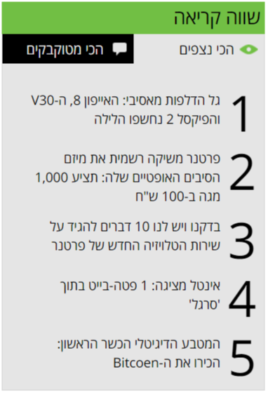

# Geektime most read widget

Time To Complete: 1 hour

1. Create the geektime most read widget (see screenshot)
1. Take a look at geektime.co.il to see it in action
1. no need to implement the tab behavior (this will require javascript)
1. make it as pixel perfect as possible
1. implement the hover over item behavior

**Challange:** don't make the numbers hard coded, use the `content` property to number the items (just like in geektime.co.il)

Screenshot:
